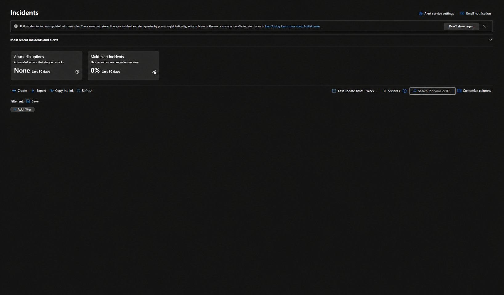
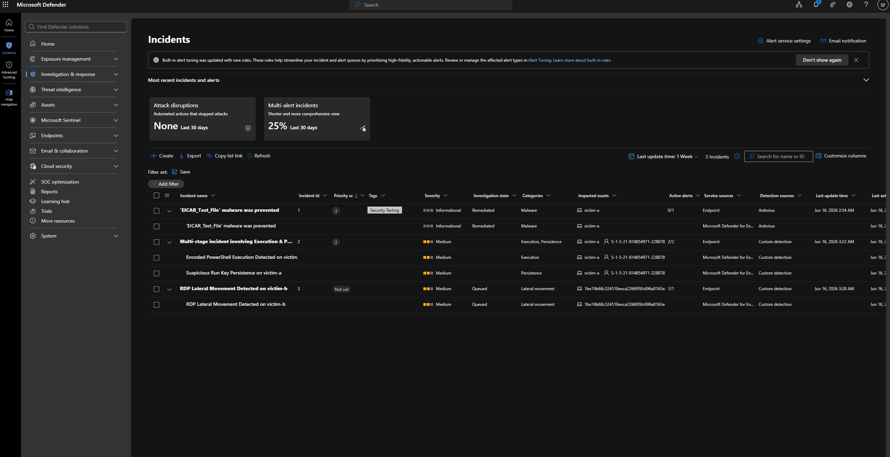
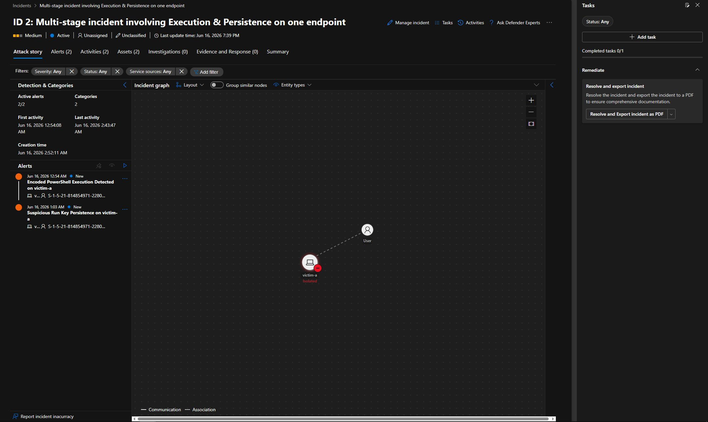
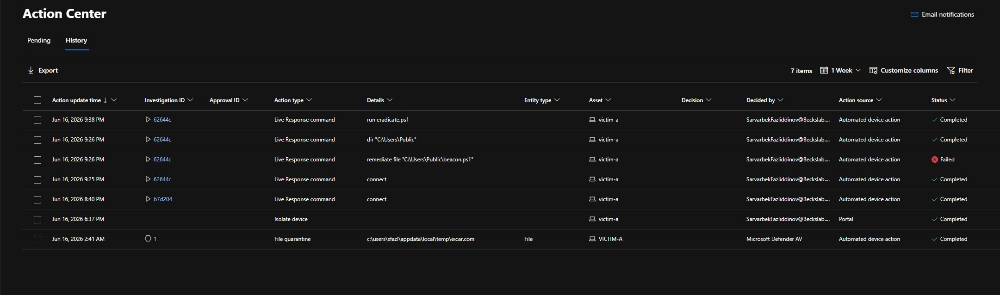

# Defender Detection Engineering Lab

I ran a six-stage attack against two Windows 11 machines protected by **Microsoft Defender for Endpoint (MDE) Plan 2**. I observed what the EDR caught on its own. Then I built my own detection rules to catch what it missed, and ran a full incident response from start to finish.

---

## The main finding

> **Out of the box, Microsoft Defender for Endpoint did not raise a single incident for the full six-stage attack — even though it recorded every step.**

Every move used real credentials and payloads that looked harmless on their own. None of them tripped Defender's built-in detection. But the data was all there. I could find every stage with a KQL query. Defender had the visibility. It just did not correlate the activity into an alert.

So I built **four custom KQL detection rules**. They caught the activity and created real incidents. One was a **multi-stage incident** that Defender named and correlated on its own from two separate alerts. From there I ran a **full incident response** and ended by removing the foothold remotely through Live Response.

The point: seeing an attack and detecting an attack are two different things. That gap is why detection engineering, threat hunting, and incident response are core security functions — you cannot rely on the default alerts alone.

### Before and after

| | Incidents created |
|---|---|
| **Default Defender** (built-in only) | **0** — full attack missed |
| **After my custom rules** | **3** — including 1 multi-stage incident |


*Default Defender created 0 incidents from the full six-stage attack. Attack disruptions: None. Multi-alert incidents: 0%.*


*After I enabled four custom rules, the same activity created three incidents — one of them multi-stage. Multi-alert incidents: 25%.*

---

## What this project shows

- **Real EDR work** — onboarding, KQL hunting, custom detection rules, incident triage, and Live Response on a live MDE Plan 2 tenant.
- **Detection engineering** — four custom rules with proper entity mapping, plus a real false-positive tuning fix.
- **Lateral movement** — two hosts, with a confirmed RDP pivot from one victim to the other (T1021.001).
- **Full incident response** — a complete NIST SP 800-61 cycle: detect, triage, contain, investigate, eradicate, verify, recover.

---

## The lab

| Role | Host | IP | Software |
|------|------|-----|----------|
| Victim A (first target, main foothold) | victim-a | 192.168.74.130 | MDE sensor, Sysmon, Atomic Red Team |
| Victim B (lateral movement target) | victim-b | 192.168.74.137 | MDE sensor, Sysmon, Atomic Red Team |
| Attacker / C2 | Kali | 192.168.74.136 | Hydra, Python http.server |

All three run on VMware Workstation on a NAT network with internet access. The sensors need internet to reach the Defender cloud. Full setup is in [lab-setup/architecture.md](lab-setup/architecture.md) and [lab-setup/mde-onboarding.md](lab-setup/mde-onboarding.md).

---

## The attack chain

Six stages, each mapped to MITRE ATT&CK, each with its own writeup:

| # | Stage | ATT&CK | Path | Writeup |
|---|-------|--------|------|---------|
| 1 | Initial access (brute force) | T1110 | Kali → victim-a | [1-initial-access-T1110.md](attack-chain/1-initial-access-T1110.md) |
| 2 | Execution (encoded PowerShell) | T1059.001 | victim-a | [2-execution-T1059.001.md](attack-chain/2-execution-T1059.001.md) |
| 3 | Persistence (Run key) | T1547.001 | victim-a | [3-persistence-T1547.001.md](attack-chain/3-persistence-T1547.001.md) |
| 4 | Discovery | T1087 / T1018 | victim-a | [4-discovery-T1087.md](attack-chain/4-discovery-T1087.md) |
| 5 | Lateral movement (RDP) | T1021.001 | victim-a → victim-b | [5-lateral-movement-T1021.001.md](attack-chain/5-lateral-movement-T1021.001.md) |
| 6 | Command & control | T1071 | victim-a → Kali | [6-command-control-T1071.md](attack-chain/6-command-control-T1071.md) |

---

## My detection rules

Four continuous (NRT) rules built in Advanced Hunting. Each one maps entities so Defender can group alerts into incidents. Full KQL, reasoning, and the tuning story are in [detections/custom-detection-rules.md](detections/custom-detection-rules.md).

| Rule | ATT&CK | Category | Table |
|------|--------|----------|-------|
| Encoded PowerShell Execution | T1059.001 | Execution | DeviceProcessEvents |
| PowerShell Outbound Network Connection | T1071 | Command & Control | DeviceNetworkEvents |
| Suspicious Run Key Persistence | T1547.001 | Persistence | DeviceRegistryEvents |
| RDP Lateral Movement Detected | T1021.001 | Lateral Movement | DeviceLogonEvents |

The persistence rule has a real before/after tuning fix. The first version flagged a harmless Microsoft Edge Run key along with the malicious one. After tuning, it flagged only the malicious one.

---

## The centerpiece: a multi-stage incident

Once my rules were live, Defender took the Encoded PowerShell alert and the Run Key Persistence alert — both on victim-a, both tied to the same user — and merged them into one incident. It named it on its own: **"Multi-stage incident involving Execution & Persistence on one endpoint."**


*The graph shows both alerts (2/2) tied to victim-a. The host shows as Isolated — the containment step, visible right in the incident.*

---

## Incident response

A full NIST SP 800-61 cycle, with proof at each step. The whole runbook is in [response/incident-response-runbook.md](response/incident-response-runbook.md).

```
DETECT      4 custom rules fired; multi-stage incident built itself
TRIAGE      Worked the incident, decoded the cradle, called it a True Positive
CONTAIN     Isolated victim-a from the Defender portal
INVESTIGATE Live Response shell on victim-a; proved the payload was never on disk
ERADICATE   Removed the Run key, disabled two accounts, blocked the attacker IP; re-ran it through Live Response
VERIFY      Confirmed the Run key was gone (locally and through Live Response)
RECOVER     Released victim-a from isolation
```


*The Action Center logs the whole response: isolation, Live Response sessions, the failed cleanup of a file that was never there, the folder check, and the script that removed the foothold.*

---

## Reusable queries

Every KQL query I used — for both hunting and detection — is in [hunting/advanced-hunting-kql.md](hunting/advanced-hunting-kql.md).

---

## Repository structure

```
defender-detection-engineering-lab/
├── README.md                          This file
├── lab-setup/
│   ├── architecture.md                Hosts, network, accounts
│   └── mde-onboarding.md              Tenant, trial, onboarding
├── attack-chain/
│   ├── 1-initial-access-T1110.md
│   ├── 2-execution-T1059.001.md
│   ├── 3-persistence-T1547.001.md
│   ├── 4-discovery-T1087.md
│   ├── 5-lateral-movement-T1021.001.md
│   └── 6-command-control-T1071.md
├── detections/
│   └── custom-detection-rules.md      4 rules + entity mapping + tuning
├── response/
│   └── incident-response-runbook.md   Full NIST 800-61 cycle
├── hunting/
│   └── advanced-hunting-kql.md        All reusable KQL
└── screenshots/                       Evidence
```

---

## About the environment

This is a closed lab built for learning and to show in a portfolio. Every host, account, and password is a lab asset. I only ran attacker tools against my own machines on an isolated virtual network. I decoded attacker commands to read them. I never ran them.
