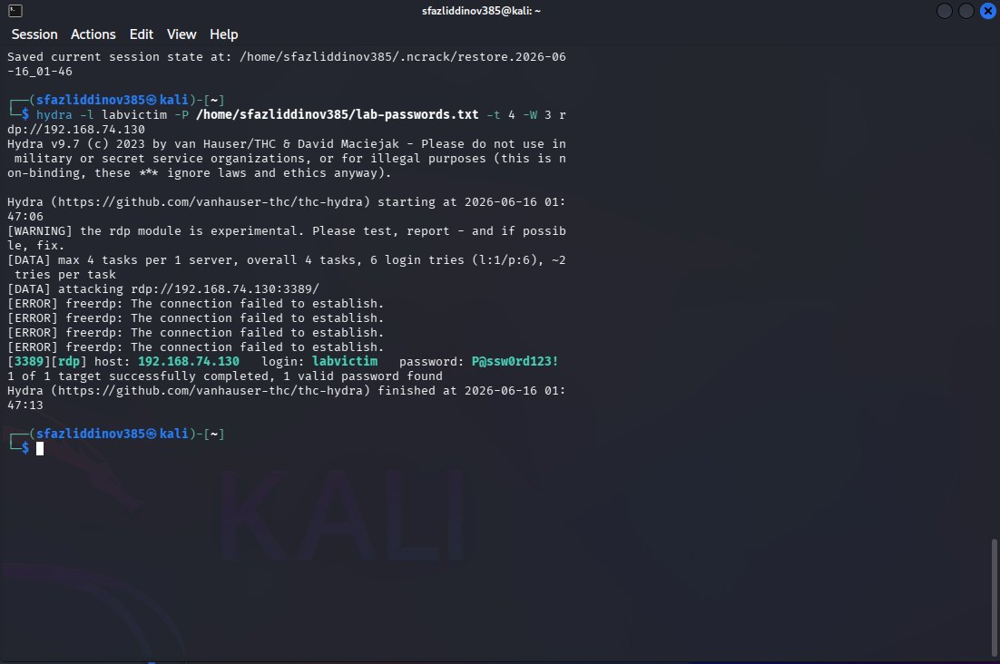
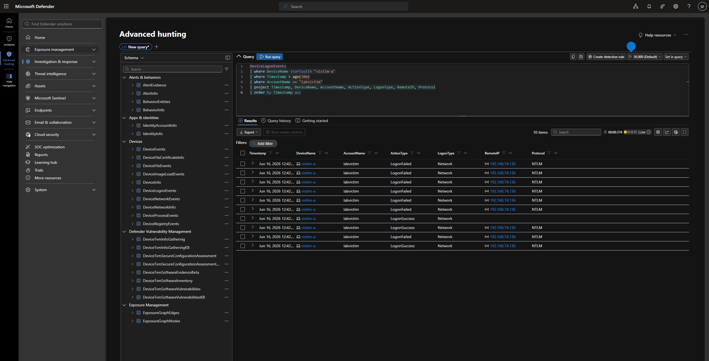

# Stage 1 — Initial Access: RDP Brute Force

**MITRE ATT&CK:** [T1110 — Brute Force](https://attack.mitre.org/techniques/T1110/)
**Path:** Kali (192.168.74.136) → victim-a (192.168.74.130)
**Table:** `DeviceLogonEvents`

---

## What I ran

From Kali, I brute-forced RDP on victim-a with Hydra:

```bash
hydra -l labvictim -P /home/sfazliddinov385/lab-passwords.txt -t 4 -W 3 rdp://192.168.74.130
```

It cracked the local `labvictim` account:

```
[3389][rdp] host: 192.168.74.130   login: labvictim   password: P@ssw0rd123!
1 of 1 target successfully completed, 1 valid password found
```


*Hydra cracking the labvictim RDP password from Kali.*

## What Defender recorded

The `DeviceLogonEvents` table caught the classic brute-force pattern: a bunch of `LogonFailed` events (Network / NTLM) from the attacker IP `192.168.74.136`, then a `LogonSuccess`.

```kusto
DeviceLogonEvents
| where DeviceName startswith "victim-a"
| where Timestamp > ago(30m)
| where AccountName == "labvictim"
| project Timestamp, DeviceName, AccountName, ActionType, LogonType, RemoteIP, Protocol
| order by Timestamp asc
```


*Failed logons, then a success, all from 192.168.74.136. That's a brute force that worked.*

## What Defender did

Defender saw all of it. Every failed and successful logon was recorded and easy to query. But the built-in detection raised **no incident**. Repeated NTLM failures ending in a success, with a real (if weak) password, didn't cross Defender's threshold.

This is the first example of the project's theme: having the data is not the same as catching the attack.

## Tier 1 triage

If this had alerted, here's how I'd work it:

- **Pattern:** a burst of `LogonFailed` from one IP, ending in `LogonSuccess` for the same account. High-confidence brute force.
- **Source:** the IP (192.168.74.136) is on the lab network but isn't a known admin box. Suspicious.
- **Verdict:** True Positive (in the lab). In a real job I'd check if that IP is an expected jump box and whether this account normally uses RDP.

## Detection takeaway

You can catch RDP brute force from `DeviceLogonEvents` by counting failures per source IP in a time window and flagging the success after. Default Defender didn't do that here on its own. That's the whole reason detection engineering and hunting matter, even with a good EDR.
