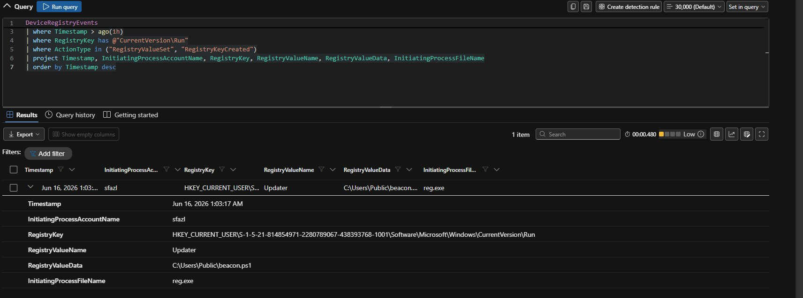

# Stage 3 — Persistence: Registry Run Key

**MITRE ATT&CK:** [T1547.001 — Registry Run Keys](https://attack.mitre.org/techniques/T1547/001/)
**Path:** victim-a
**Table:** `DeviceRegistryEvents`

---

## What I ran

On victim-a, as `sfazl`, I set up persistence by writing a Run key with `reg.exe`. The key was named `Updater` and pointed at a script path:

- **Key:** `HKEY_CURRENT_USER\...\CurrentVersion\Run`
- **Value name:** `Updater`
- **Value data:** `C:\Users\Public\beacon.ps1`
- **Started by:** `reg.exe`


*The Updater Run key written to HKCU, pointing at beacon.ps1, started by reg.exe as sfazl.*

## What Defender recorded

```kusto
DeviceRegistryEvents
| where Timestamp > ago(1h)
| where RegistryKey has @"CurrentVersion\Run"
| where ActionType in ("RegistryValueSet", "RegistryKeyCreated")
| project Timestamp, InitiatingProcessAccountName, RegistryKey, RegistryValueName, RegistryValueData, InitiatingProcessFileName
| order by Timestamp desc
```

The full key path was:

```
HKEY_CURRENT_USER\S-1-5-21-814854971-2280789067-438393768-1001\Software\Microsoft\Windows\CurrentVersion\Run
```

The SID ending in `-1001` confirms this is the `sfazl` user.

## A detail found during cleanup

When I went to clean up, I found that `beacon.ps1` was **not actually on disk** in `C:\Users\Public`. The Run key pointed at the file, but the file was never dropped there.

So the **Run key itself was the real foothold** — not a payload file. This changed how I did the cleanup. Removing the Run key was the fix that mattered, and the attempt to remove the missing file failed. See the [runbook](../response/incident-response-runbook.md#investigate-and-eradicate) for how that played out in Live Response.

## What Defender did

Default Defender raised **no incident** for the Run key write. Writing to a Run key is very common — normal apps do it constantly. A rule that flags every Run key write would be useless. Default detection did not flag this one.

This is what my Suspicious Run Key Persistence rule was built to catch. It is also where the tuning story lives, because a harmless Microsoft Edge Run key showed up next to the malicious one. See [detections/custom-detection-rules.md](../detections/custom-detection-rules.md#rule-3--suspicious-run-key-persistence).

## Tier 1 triage

- **Key:** an HKCU Run value named `Updater` is generic on purpose. It blends in.
- **Value data:** a `.ps1` path under `C:\Users\Public` is unusual. Public is writable by anyone and is not where a real startup script lives.
- **Started by:** `reg.exe` writing a Run key is worth examining. Real apps usually set startup entries through their own installer, not a one-off `reg.exe` call.
- **Verdict:** True Positive.

## Detection takeaway

You can catch Run key persistence from `DeviceRegistryEvents`, but this is the clearest case in the project for why **tuning** is required. The signal is buried in normal activity. The rule has to focus on script files and unusual paths while skipping known-good apps.
