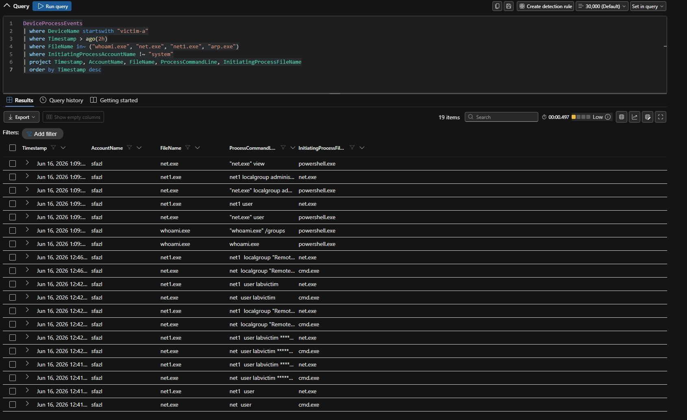

# Stage 4 — Discovery

**MITRE ATT&CK:** [T1087 — Account Discovery](https://attack.mitre.org/techniques/T1087/) and [T1018 — Remote System Discovery](https://attack.mitre.org/techniques/T1018/)
**Path:** victim-a
**Table:** `DeviceProcessEvents`

---

## What I ran

On victim-a, as `sfazl`, I ran standard built-in commands to enumerate the host — the local account, group membership, and what else was reachable. This is the reconnaissance an attacker does after gaining access and before moving to another machine:

- `whoami /groups` — current user's groups
- `net user` — local accounts
- `net user labvictim` — detail on the compromised account
- `net localgroup administrators` — local admin membership
- `net localgroup "Remote Desktop Users"` — who can log in over RDP
- `net view` — reachable systems on the network


*Discovery commands (whoami, net user, net localgroup, net view) in DeviceProcessEvents, all run as sfazl.*

## What Defender recorded

```kusto
DeviceProcessEvents
| where DeviceName startswith "victim-a"
| where Timestamp > ago(2h)
| where FileName in~ ("whoami.exe", "net.exe", "net1.exe", "arp.exe")
| where InitiatingProcessAccountName !~ "system"
| project Timestamp, AccountName, FileName, ProcessCommandLine, InitiatingProcessFileName
| order by Timestamp desc
```

Note that `net.exe` often spawns `net1.exe` as a child process, so both appear in the results. This is normal Windows behavior and worth recognizing when reading the data.

## What Defender did

Default Defender raised **no incident** for the discovery activity. Each of these is a normal administrative tool used constantly across any environment. On its own, none crosses a detection threshold. That is exactly why discovery is so easy to hide in normal activity.

Discovery is deliberately **not** one of my four detection rules. Catching it well requires behavioral logic — for example, many distinct recon commands from one process in a short window. That is a more advanced build. I am documenting this stage to keep the attack story complete and to show the telemetry exists for hunting.

## Tier 1 triage

- **Commands:** harmless individually, a recon pattern together. A single `whoami` is nothing. But `whoami /groups`, then `net user`, `net localgroup administrators`, `net localgroup "Remote Desktop Users"`, and `net view` back to back from one session is a clear reconnaissance sequence.
- **Context:** this matters most *after* an initial-access alert. Alone it is weak. Chained to the Stage 1 brute force and Stage 2 execution on the same host, it adds weight that the host is compromised.
- **Verdict:** suspicious in aggregate, low confidence in isolation.

## Detection takeaway

Discovery is the hardest stage to catch cleanly because it relies entirely on native tools. The realistic approach is behavioral — counting distinct recon commands per host or user over a time window — rather than alerting on any single command. This stage is a good reminder that not every ATT&CK technique needs its own rule.
