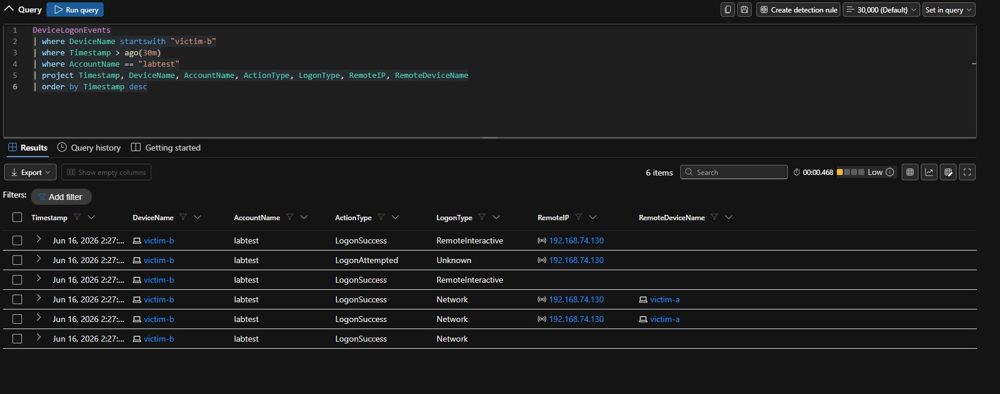
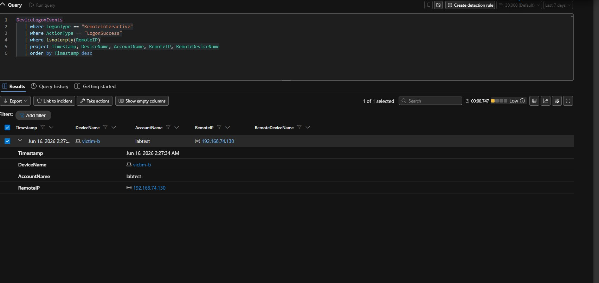

# Stage 5 — Lateral Movement: RDP

**MITRE ATT&CK:** [T1021.001 — Remote Desktop Protocol](https://attack.mitre.org/techniques/T1021/001/)
**Path:** victim-a (192.168.74.130) → victim-b (192.168.74.137)
**Table:** `DeviceLogonEvents`

---

## What I ran

From victim-a, I jumped to the second machine, victim-b, over RDP using the `labtest` account. This is the lateral move — the attacker spreading from the first foothold to a second box with reused credentials.

The key evidence on victim-b's `DeviceLogonEvents`:

- **Account:** `labtest`
- **ActionType:** `LogonSuccess`
- **LogonType:** `RemoteInteractive` (that's the RDP signature)
- **RemoteIP:** `192.168.74.130` (victim-a — where the jump came from)
- **RemoteDeviceName:** `victim-a`


*victim-b's DeviceLogonEvents showing a RemoteInteractive LogonSuccess for labtest, from 192.168.74.130 (victim-a).*


*The full logon record confirming the jump: labtest, victim-b, from RemoteIP 192.168.74.130.*

## What Defender recorded

```kusto
DeviceLogonEvents
| where DeviceName startswith "victim-b"
| where Timestamp > ago(30m)
| where AccountName == "labtest"
| project Timestamp, DeviceName, AccountName, ActionType, LogonType, RemoteIP, RemoteDeviceName
| order by Timestamp desc
```

`RemoteInteractive` plus a filled-in `RemoteIP` and `RemoteDeviceName` is the cross-host signature. That's what makes RDP lateral movement both catchable and traceable back to the source machine.

## What Defender did

Default Defender raised **no incident** for the RDP jump. A successful interactive logon with valid credentials looks normal. That's exactly why credential-based lateral movement works. The activity was fully visible but didn't auto-detect.

This is what my RDP Lateral Movement rule was built to catch. When it fired, it made its own incident — **"RDP Lateral Movement Detected on victim-b"** — and Defender mapped the source machine as a second device entity, giving cross-host context. See [detections/custom-detection-rules.md](../detections/custom-detection-rules.md#rule-4--rdp-lateral-movement-detected).

## Tier 1 triage

- **Logon type:** `RemoteInteractive` means RDP. A successful RDP logon from a non-admin box is worth a look.
- **Source:** `RemoteIP` 192.168.74.130 (victim-a) — and victim-a is the box I already compromised in Stages 1–4. The jump ties the two machines into one attack.
- **Account:** `labtest` logging in over RDP from another internal workstation — is that normal for this account? In the lab, no.
- **Verdict:** True Positive. This is the high point of the project — a confirmed jump from one protected machine to another.

## Detection takeaway

RDP lateral movement is clean to catch from `DeviceLogonEvents`. Filter for `LogonType == "RemoteInteractive"`, `ActionType == "LogonSuccess"`, and a non-empty `RemoteIP`. Because this table shows `RemoteIP` and `RemoteDeviceName` directly, the rule can tie the source and target machines together. That's what gives the incident cross-host context.
