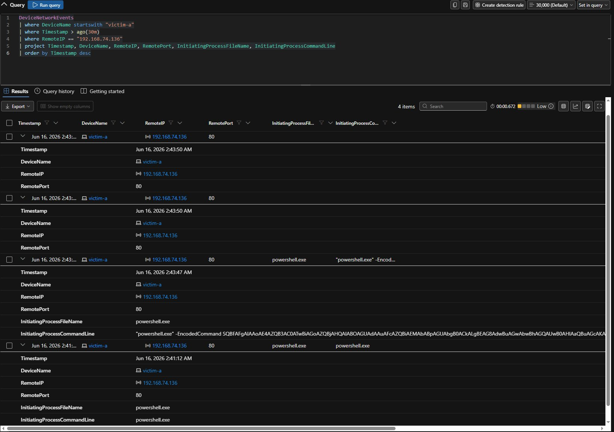

# Stage 6 — Command & Control

**MITRE ATT&CK:** [T1071 — Application Layer Protocol](https://attack.mitre.org/techniques/T1071/)
**Path:** victim-a (192.168.74.130) → Kali (192.168.74.136)
**Table:** `DeviceNetworkEvents`

---

## What I ran

The download cradle from Stage 2 made an outbound connection from victim-a to Kali, standing in for a command-and-control channel over HTTP. This is the network side of the same encoded PowerShell activity.

- **Started by:** `powershell.exe`
- **Remote IP:** `192.168.74.136` (Kali)
- **Remote port:** `80`


*DeviceNetworkEvents showing powershell.exe on victim-a connecting out to 192.168.74.136 on port 80 — the cradle/beacon channel to Kali.*

## What Defender recorded

```kusto
DeviceNetworkEvents
| where DeviceName startswith "victim-a"
| where Timestamp > ago(30m)
| where RemoteIP == "192.168.74.136"
| project Timestamp, DeviceName, RemoteIP, RemotePort, InitiatingProcessFileName, InitiatingProcessCommandLine
| order by Timestamp desc
```

The connection ties back to the encoded command from Stage 2 — the same `powershell.exe -EncodedCommand` process made the outbound connection. That links execution and C2 into one chain.

## Schema note

`DeviceNetworkEvents` does **not** have `AccountName` or `AccountSid`. To name the acting account you use `InitiatingProcessAccountName` and `InitiatingProcessAccountSid` instead. Using `AccountName` here gives a "Failed to resolve scalar expression named 'AccountName'" error. This matters when you build the C2 rule — see [detections/custom-detection-rules.md](../detections/custom-detection-rules.md#rule-2--powershell-outbound-network-connection).

## What Defender did

Default Defender raised **no incident** for the connection. An HTTP connection on port 80 from PowerShell looks like any other web request without context. The activity was visible but didn't auto-detect.

This is what my PowerShell Outbound Network Connection rule was built to catch. It flags `powershell.exe` connecting to common C2 ports (80, 443, 8080, 4444) and skips the system account.

## Tier 1 triage

- **Started by:** `powershell.exe` making an outbound connection is itself notable. PowerShell hitting the network is much less common than a browser doing it.
- **Where to:** 192.168.74.136 (Kali) on port 80. Tied to the Stage 2 decode, that's the exact host and path (`/payload.ps1`) from the cradle.
- **Chain:** this is the same process as the encoded run. Execution and C2 are two views of one action.
- **Verdict:** True Positive.

## Detection takeaway

PowerShell connecting out to common C2 ports is a high-value, low-noise catch from `DeviceNetworkEvents`. The real tuning is around normal PowerShell network use (module updates, internal scripts). That's why the rule sticks to specific ports and skips the system account.
