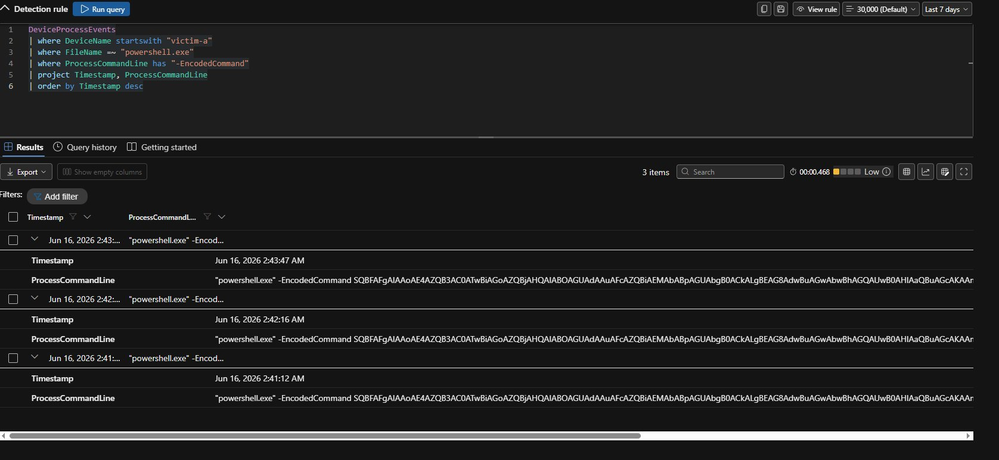
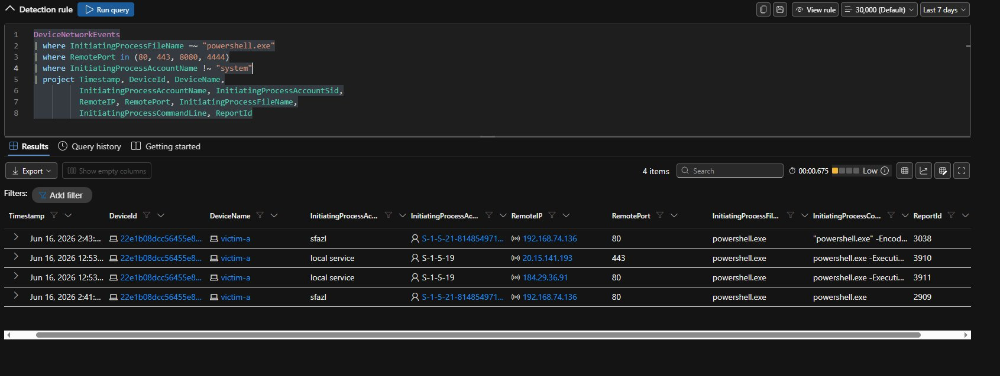
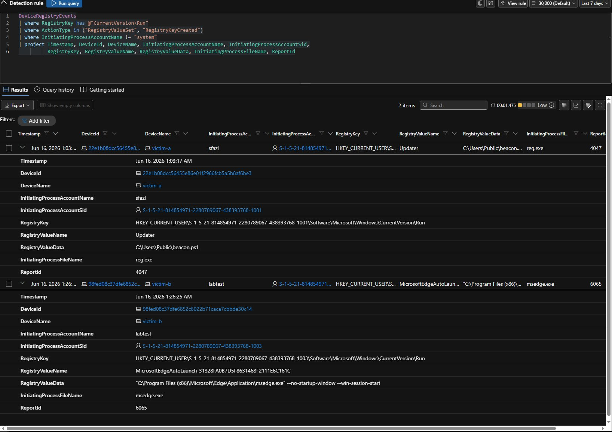
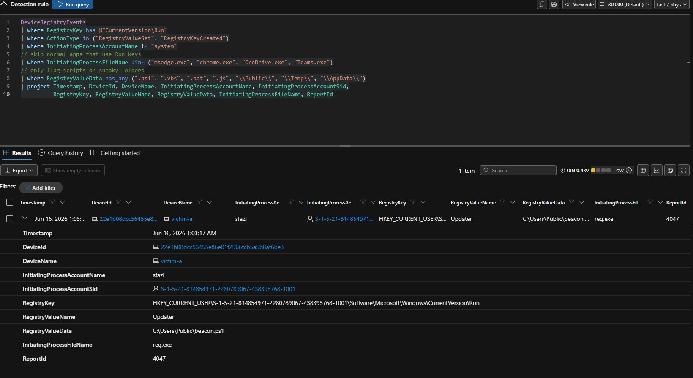
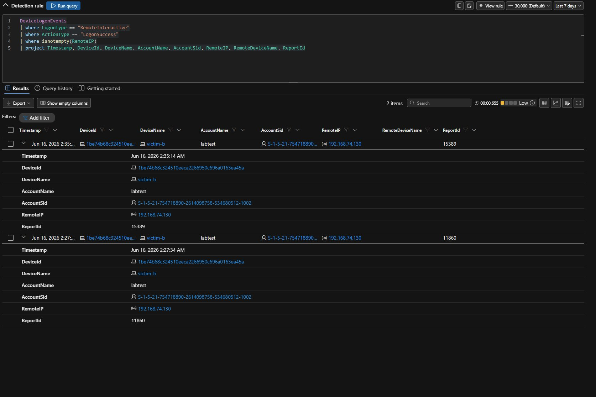

# Custom Detection Rules

This is the detection engineering part of the project. After I confirmed default Defender raised zero incidents for the attack, I built four custom rules in Advanced Hunting to catch the activity and create incidents.

I built all four through **Advanced Hunting → "Create detection rule"**, set to **Continuous (NRT)**, with **entity mappings** so Defender can group alerts into incidents.

## Why entity mapping matters

A rule that just returns rows is a hunting query. To make it a real detection that creates grouped incidents, the rule has to map result columns to entities — at least a **Device** (`DeviceId`) and a **User** (a SID column). Defender groups alerts that share entities into one incident. That is what produced the multi-stage incident at the end of this page.

Two practical notes:

- A half-filled "Related Evidence" entity blocks saving. Either finish its column dropdown or remove it with the blue X.
- If the top-right button says **"View rule"**, you are editing an existing rule. To get the **"Create detection rule"** button, open a fresh query (the **+** tab).

---

## Rule 1 — Encoded PowerShell Execution

**ATT&CK:** T1059.001 (Execution) · **Severity:** Medium · **Table:** `DeviceProcessEvents`

```kusto
DeviceProcessEvents
| where FileName =~ "powershell.exe"
| where ProcessCommandLine has_any ("-EncodedCommand", "-enc", "-e ")
| where InitiatingProcessAccountName !~ "system"
| project Timestamp, DeviceId, DeviceName, AccountName, AccountSid,
          ProcessCommandLine, InitiatingProcessFileName, ReportId
```

**Entities:** Device → `DeviceId`; User → SID → `AccountSid`.

**Why:** matches PowerShell run with an encoded-command flag — the technique from Stage 2. Skipping the system account drops legitimate system-run encoded commands, which are common and noisy.

**Result:** this rule fired and created the first custom-detection alert, which became part of the multi-stage incident.


*The Encoded PowerShell Execution rule matching the Stage 2 activity.*

---

## Rule 2 — PowerShell Outbound Network Connection

**ATT&CK:** T1071 (Command & Control) · **Severity:** Medium · **Table:** `DeviceNetworkEvents`

```kusto
DeviceNetworkEvents
| where InitiatingProcessFileName =~ "powershell.exe"
| where RemotePort in (80, 443, 8080, 4444)
| where InitiatingProcessAccountName !~ "system"
| project Timestamp, DeviceId, DeviceName,
          InitiatingProcessAccountName, InitiatingProcessAccountSid,
          RemoteIP, RemotePort, InitiatingProcessFileName,
          InitiatingProcessCommandLine, ReportId
```

**Entities:** Device → `DeviceId`; User → SID → `InitiatingProcessAccountSid`.

**Schema note:** `DeviceNetworkEvents` has **no** `AccountName` / `AccountSid`. You have to use `InitiatingProcessAccountName` / `InitiatingProcessAccountSid`. Using `AccountName` throws "Failed to resolve scalar expression named 'AccountName'". This caught me before I fixed it.

**Why:** flags PowerShell connecting out to common C2 ports — the network side of Stage 6. Sticking to specific ports and skipping the system account keeps it clean.


*The PowerShell Outbound Network Connection rule with Device and SID entities mapped.*

---

## Rule 3 — Suspicious Run Key Persistence

**ATT&CK:** T1547.001 (Persistence) · **Severity:** Medium · **Table:** `DeviceRegistryEvents`

```kusto
DeviceRegistryEvents
| where RegistryKey has @"CurrentVersion\Run"
| where ActionType in ("RegistryValueSet", "RegistryKeyCreated")
| where InitiatingProcessAccountName !~ "system"
// skip normal apps that use Run keys
| where InitiatingProcessFileName !in~ ("msedge.exe", "chrome.exe", "OneDrive.exe", "Teams.exe")
// only flag scripts or sneaky folders
| where RegistryValueData has_any (".ps1", ".vbs", ".bat", ".js", "\\Public\\", "\\Temp\\", "\\AppData\\")
| project Timestamp, DeviceId, DeviceName, InitiatingProcessAccountName, InitiatingProcessAccountSid,
          RegistryKey, RegistryValueName, RegistryValueData, InitiatingProcessFileName, ReportId
```

**Entities:** Device → `DeviceId`; User → SID → `InitiatingProcessAccountSid`.

### The tuning story

This rule is the clearest example of real detection engineering in the project, because the first version was noisy.

**Before tuning** — a basic query matching any Run key write returned **2 rows**:

1. The malicious one: `Updater` → `C:\Users\Public\beacon.ps1` on victim-a (the real persistence).
2. A harmless one: `MicrosoftEdgeAutoLaunch_...` on victim-b, written by `msedge.exe` (normal browser startup).


*Before tuning: the rule returned the malicious Updater key AND a harmless Microsoft Edge startup key.*

**After tuning** — I added two refinements:

- Skip known-good apps that use Run keys (`msedge.exe`, `chrome.exe`, `OneDrive.exe`, `Teams.exe`).
- Require the value to contain a script extension or an unusual path (`.ps1`, `.vbs`, `.bat`, `.js`, `\Public\`, `\Temp\`, `\AppData\`).

That dropped it to **1 row — only the malicious one.**


*After tuning: only the malicious Updater key. The Edge key is gone.*

This before/after is what detection engineering is. A true positive alone is not enough. A rule has to ignore normal activity to be usable. Cutting two rows to one — dropping the false positive while keeping the true detection — is the exact tradeoff a detection engineer manages.

---

## Rule 4 — RDP Lateral Movement Detected

**ATT&CK:** T1021.001 (Lateral Movement) · **Severity:** Medium · **Table:** `DeviceLogonEvents`

```kusto
DeviceLogonEvents
| where LogonType == "RemoteInteractive"
| where ActionType == "LogonSuccess"
| where isnotempty(RemoteIP)
| project Timestamp, DeviceId, DeviceName, AccountName, AccountSid, RemoteIP, RemoteDeviceName, ReportId
```

**Entities:** Device → `DeviceId`; a **second** Device → `RemoteDeviceName` (the source machine); User → SID → `AccountSid`; Related Evidence IP → `RemoteIP` (the source IP).

**Why:** flags successful RemoteInteractive (RDP) logons with a remote source — the pivot from Stage 5. Note this table has `AccountSid` directly (no `Initiating` prefix), unlike `DeviceNetworkEvents`.

**Entity mapping detail:** Defender mapped this rule's entities better than I expected. Mapping `RemoteDeviceName` as a *second* device gives the incident cross-host context — it shows both the target (victim-b) and the source (victim-a) of the pivot.

**Result:** this rule fired and created its own incident, "RDP Lateral Movement Detected on victim-b".


*The RDP Lateral Movement rule matching the Stage 5 pivot, with source and target machine entities.*

---

## The payoff: a multi-stage incident

With the rules live, the Incidents page went from empty to populated. The key one:

**"Multi-stage incident involving Execution & Persistence on one endpoint"** — Medium, categories Execution + Persistence, **2/2 alerts**, detection source Custom detection, asset victim-a.

Defender took the **Encoded PowerShell** alert and the **Run Key Persistence** alert — both on victim-a, both tied to the same `sfazl` user — and merged them into one multi-stage incident. It named it on its own.


*The graph showing both alerts (2/2) tied to victim-a, which also shows as Isolated.*

### An honest note on the grouping

Defender grouped the two **same-host, same-user** victim-a alerts (Execution + Persistence, both `sfazl`) into one incident. The victim-b lateral-movement alert (different machine, account `labtest`) stayed a **separate** incident. It did not merge into one combined victim-a + victim-b incident.

That is expected. Defender groups on shared entities and timing. The victim-b alert shares neither the machine nor the account, so it stayed on its own. In a real attack with more overlap (like the same account used across machines), they would merge more often. Stating this plainly is more honest than overselling the grouping — it shows I understand *how* and *why* the EDR groups alerts, not just *that* it does.

The result: the "Multi-alert incidents" tile changed from 0% to 25%, which confirmed the grouping worked.
